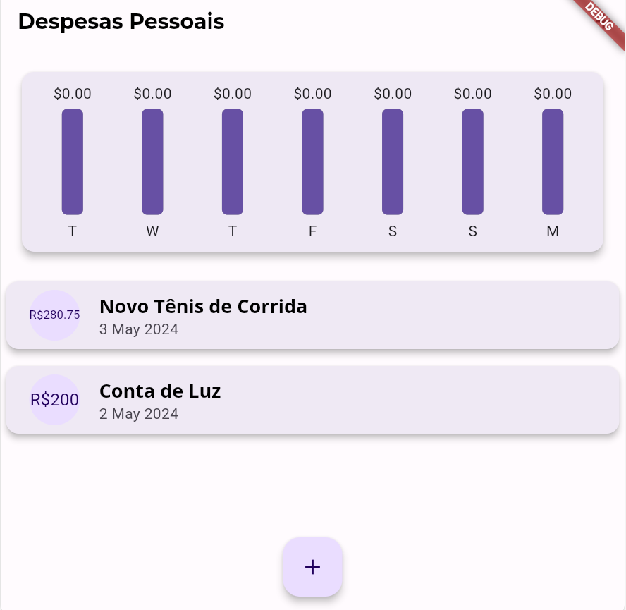
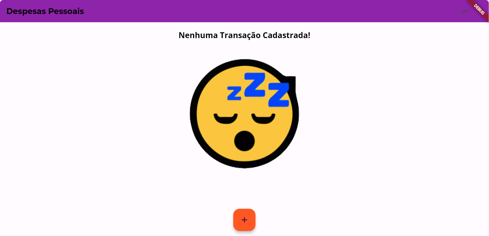
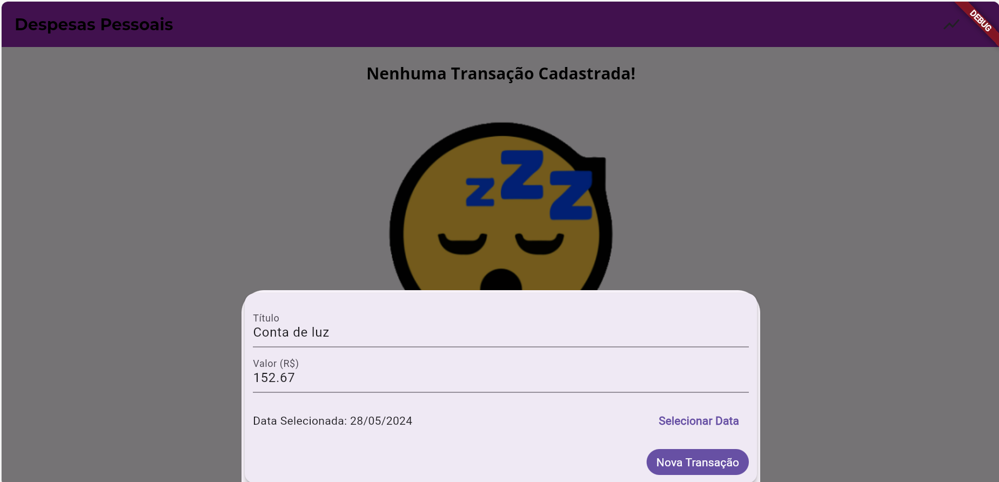

# expenses

Despesas Pessoais
Este é um aplicativo de controle de despesas pessoais desenvolvido em Flutter. Ele permite registrar transações financeiras e visualizar estatísticas por meio de gráficos.

## Funcionalidades Principais

Funcionalidades Principais
Adicionar novas transações com título, valor e data.
Visualizar lista de transações recentes.
Visualizar gráfico de despesas dos últimos 7 dias.

## Capturas de Tela

Capturas de Tela
Tela Inicial 

Página inicial com lista de transações e botão para adicionar nova transação.

Nenhuma Transação

Adicionar Transação

Formulário para adicionar nova transação.

## Como Executar

Para executar o projeto em seu ambiente local, siga as etapas abaixo:

1. Certifique-se de ter o Flutter instalado em sua máquina. Você pode verificar executando o comando `flutter --version` no terminal.
2. Clone este repositório para o seu ambiente local.
3. Abra o diretório do projeto no terminal.
4. Execute o comando `flutter pub get` para instalar as dependências do projeto.
5. Execute o comando `flutter run` para iniciar o aplicativo no dispositivo/emulador conectado.

## Pacotes Utilizados

intl: Para formatação de datas e valores monetários.
flutter_png: Para renderizar imagens PNG.
charts_flutter: Para criar gráficos de barras.

## Contribuição

Contribuições são bem-vindas! Sinta-se à vontade para abrir novas issues ou pull requests para melhorias no código.

## Autor

Este aplicativo foi desenvolvido por Pedro Antônio como parte do aprendizado em Flutter.

